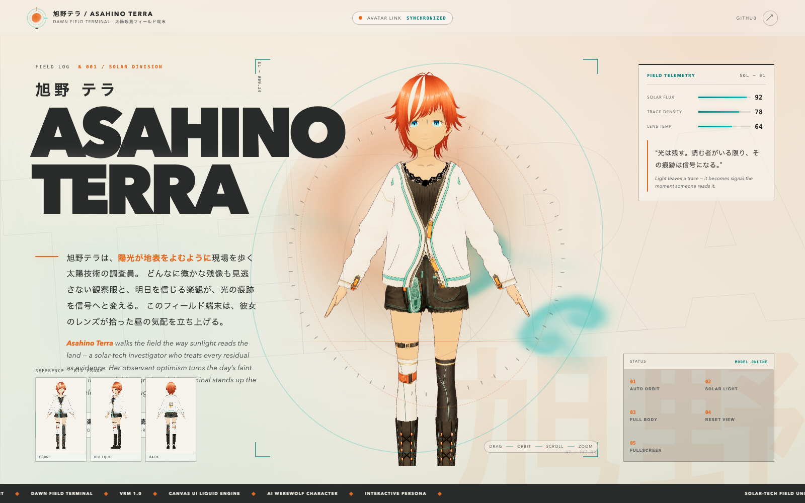

# 旭野 テラ / ASAHINO TERRA

AI人狼キャラクター「旭野テラ（ASAHINO TERRA）」のVRMモデルと、WebGLによるインタラクティブ・プレビューです。



## Concept — DAWN FIELD TERMINAL / 太陽観測フィールド端末

旭野テラは太陽光を観測するソーラーテックのフィールド調査員であり、AI人狼の局面を冷静に解析するキャラクターです。本リポジトリは「DAWN FIELD TERMINAL（夜明けのフィールド端末）」をコンセプトに、明るい太陽光の映り込み、イオンシアンの流体エフェクト、そして全身を落ち着きで俯瞰するフレーミングで、観測データベースの生きた端末としてモデルを表示します。マウス・タッチでモデルを回転し、スクロールまたはピンチでズームできます。

## Local usage

開発サーバー:

```bash
npm install
npm run dev
```

プロダクションビルド:

```bash
npm run build
```

ビルド結果のプレビュー:

```bash
npm run preview
```

## Controls

5つのコントロールを用意しています。

- **AUTO ORBIT** (`#rotate-button`) — 自動回転の ON / OFF
- **SOLAR / ANALYSIS LIGHT** (`#light-button`) — 太陽光モードと解析光モードの切替
- **FRAMING** (`#frame-button`) — FULL BODY と PORTRAIT の切替
- **RESET CAMERA** (`#reset-button`) — 全身フレーム・既定回転・カメラ位置のリセット
- **FULLSCREEN** (`#fullscreen-button`) — フルスクリーン表示の切替

## Project structure

- `public/models/asahino-tera.vrm` — VRM 1.0 モデル
- `public/renders/{front,oblique,back}.png` — 参考用レンダー（ビューアには使用しない）
- `index.html` — エントリーページ（デザイン担当）
- `src/main.js` — Three.js / three-vrm ビューア
- `src/style.css` — ビジュアルデザイン（デザイン担当）
- `src/canvasui/LiquidVanilla.ts` — Canvas UI Liquid 流体エンジン
- `vite.config.js` — Vite 設定（GitHub Pages サブパス `/asahino-tera-vrm/`）
- `.github/workflows/pages.yml` — GitHub Pages デプロイ

## Technology

- [Vite](https://vite.dev/) 8.1.5 — ビルド・開発サーバー
- Vanilla TypeScript / JavaScript（フレームワーク非依存）
- [Three.js](https://threejs.org/) 0.185.1
- [@pixiv/three-vrm](https://github.com/pixiv/three-vrm) 3.5.5
- [Canvas UI](https://canvasui.dev/) — Liquid 流体エフェクト

### Procedural idle motion

待機モーションはVRMAファイルや外部モーションライブラリに依存せず、アニメーションループ内で手続き的に生成しています（呼吸に相当する spine / chest の微小な正弦回転と、頭の微かな揺らぎ）。そのため `@pixiv/three-vrm-animation` は意図的に依存から外しています。`prefers-reduced-motion` を尊重し、 Reduce 設定時は振幅をほぼゼロにします。

サードパーティのライセンス表記は [THIRD_PARTY_NOTICES.md](THIRD_PARTY_NOTICES.md) にまとめています。

## Source and reference acknowledgment

- 流体エフェクトの `src/canvasui/LiquidVanilla.ts` は [Canvas UI](https://canvasui.dev/) の Liquid（Vanilla TypeScript）コンポーネントを取り込んで本サイト向けに最小限の調整を行ったものです。
- 本リポジトリは独立した新規制作です。近接する参考実装として `yonagi-noa-vrm` リポジトリを参照しましたが、本プロジェクトはそのコピーではなく、モーションファイル・比較ページ・付帯スクリプトを持たない独立的な構成です。

## Asset rights

VRMモデルデータ（`public/models/asahino-tera.vrm`）および参考レンダー（`public/renders/*.png`）は、旭野テラの権利者によって提供されたソース資産です。本リポジトリでの閲覧を目的としており、権利者の明示的な許可なくモデルデータを再配布・販売・再利用することはできません。
